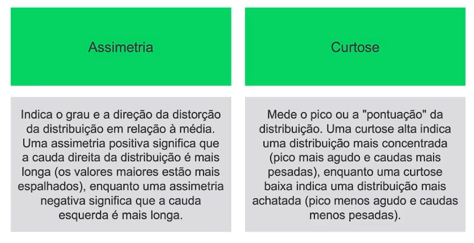
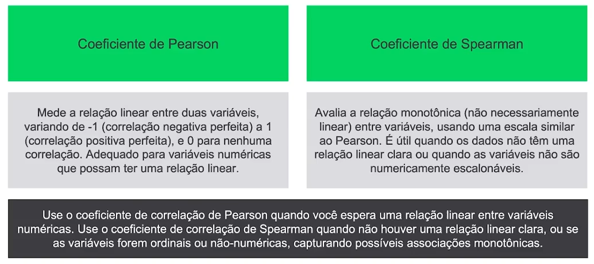
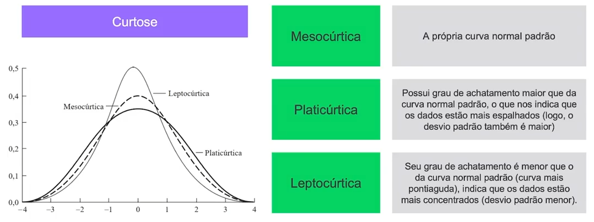

# ai-development

## Correção de dados

Correlação é uma medida estatística que descreve a relação entre duas variáveis. Ela indica a força e a direção do relacionamento linear entre essas variáveis. Em termos simples, a correlação mostra se e como duas variáveis estão relacionadas entre si.

### Tipos de Correlação

    Correlação Positiva:
        Quando uma variável aumenta, a outra também tende a aumentar.
        Exemplo: A altura e o peso de uma pessoa geralmente têm uma correlação positiva.

    Correlação Negativa:
        Quando uma variável aumenta, a outra tende a diminuir.
        Exemplo: O tempo gasto estudando e o número de erros em um teste podem ter uma correlação negativa.

    Sem Correlação:
        Não há uma relação clara entre as duas variáveis.
        Exemplo: A cor dos olhos e o desempenho em matemática geralmente não têm uma correlação significativa.

### Coeficiente de Correlação

O coeficiente de correlação quantifica a força e a direção dessa relação. O coeficiente varia entre -1 e 1:

    +1: Correlação positiva perfeita. As variáveis se movem juntas de forma perfeita.
    0: Nenhuma correlação linear. As variáveis não têm uma relação linear.
    -1: Correlação negativa perfeita. Quando uma variável aumenta, a outra diminui de forma perfeita.

#### Coeficiente de Correlação de Spearman

    Mede a relação monotônica entre duas variáveis. É uma versão não paramétrica do coeficiente de Pearson e é usado quando os dados não atendem às suposições do teste de Pearson.
    Calculado com base nos ranks (posições) das variáveis.

### Exemplo

Correlação entre a tempo de serviço de um colaborador e o salário do mesmo.

Temos como resultado uma correlação positiva, pois conforme a variável de tempo de serviço aumenta, a variável de salário também aumenta.
